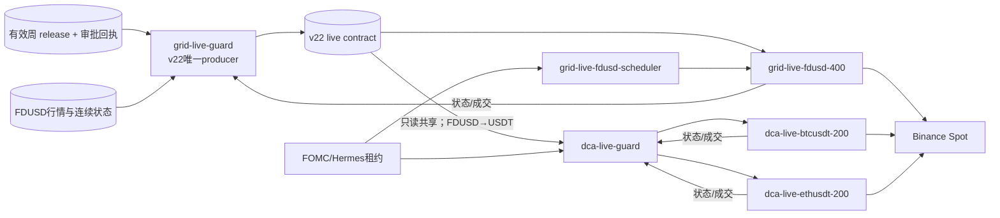

# 容器结构与信号链路

## 当前结论

OCI 已切换到 v22 live，不再是 observer/legacy 并行模式。生产中只有一个 v22
producer，不新增风控容器：

- `grid-live-guard`：唯一 v22 producer，验证 release、授权、行情、哈希和当前周，
  发布有执行语义的 `xgboost_risk_gate.json`。
- `grid-live-fdusd-400`：直接消费 BTC/ETH-FDUSD 信号并提交 Grid 订单。
- `dca-live-guard`：通过只读共享目录消费同一合同，映射 FDUSD→USDT，并作为 DCA
  controller gate 唯一写入者。
- `dca-live-btcusdt-200`、`dca-live-ethusdt-200`：按 controller 创建 executor。
- v21 producer 已关闭；ROC/SQZMOM 不构成第二技术门，也不能作为回退。

动态模型身份和当前周见 [ONLINE_MODELS.md](ONLINE_MODELS.md)。

## 三个平面

| 平面 | 容器 | 职责 |
|---|---|---|
| 交易执行 | `grid-live-fdusd-400`、两个 DCA 机器人 | 下单、成交、权益和策略状态 |
| 风控控制 | Grid/DCA Guard、Grid scheduler、macro gateway | 生成/消费信号、聚合门、强制退出和恢复 |
| 审计通知 | `dca-live-report` | 只读报告、Plotly/PNG、Telegram outbox；模型更新只发三窗口 PNG |

`hummingbot-api`、`hummingbot-broker`、`hummingbot-api-postgres` 分别提供编排、MQTT
和持久化；它们不决定模型信号。manager 服务是一次性部署工具，不是常驻信号链。

## 当前生产链路



Grid 普通 BUY 条件：

```text
v22已授权、健康且该对Risk-On
AND FOMC放行
AND 单对/组合亏损与回撤未阻塞
AND 持仓保护允许
AND recovery phase=ACTIVE
AND 交易所、行情、资金和过滤器健康
```

DCA 使用相同 AND 语义，最终结果由 `dca-live-guard` 写入每个 controller 的 BUY/SELL
门。普通 BUY 门不阻塞必要 SELL；但 `EXITING/COOLDOWN/REENTRY` 为防竞态会临时关闭
双侧，直到退出或重入完成。

## 容器职责

| 容器 | 当前模式 | 关键动作 |
|---|---|---|
| `grid-live-guard` | live、armed | v22推理/合同发布、Grid紧急撤单与归属库存退出 |
| `dca-live-guard` | live、armed | 合同映射、controller聚合、DCA紧急撤单与归属库存退出 |
| `grid-live-fdusd-400` | live | BTC/ETH-FDUSD Grid订单和策略内风控 |
| `dca-live-btcusdt-200` | live | BTC-USDT DCA executor |
| `dca-live-ethusdt-200` | live | ETH-USDT DCA executor |
| `grid-live-fdusd-scheduler` | live admin | Grid参数、脚本与FOMC gate分发 |
| `dca-macro-gateway` | live | 宏观审批租约和方向门 |
| `dca-live-report` | read-only | 报告和通知，不回写交易 |

## 共享目录边界

| 目录 | 主要写入者 | 主要只读消费者 | 内容 |
|---|---|---|---|
| `grid-live-fdusd-data` | Grid Guard/scheduler | DCA Guard/report | v22合同、Grid Guard状态、宏观gate、资金归属 |
| `dca-live-data` | DCA Guard/report | 运维审计 | DCA Guard状态、归属库存、报告与outbox |
| `api-files/bots` | API/scheduler/机器人 | Guards/report | 配置、controller、数据库、Grid runtime |
| `dca-macro-data` | macro gateway | scheduler/DCA Guard | 宏观租约和方向门 |
| `release_packages/ethbtc-forced-exit/current` | 发布流程切换 | Grid Guard只读 | 当前签名release和锁文件 |

DCA 不能修改 producer 合同，report 不能修改交易状态，macro gateway 不直接写 DCA
controller。生产中不得启动第二个 v22 producer。

## Fail-Closed 与退出

- 健康 Risk-Off：该交易对停止新单、撤单、退出机器人归属基础币；模型恢复且其他门
  放行后可自动重入。
- 合同缺失/过期、哈希/授权/当前周错误：停止新风险、退出后 `LATCHED`，人工处理。
- 禁止回退 v21、ROC、SQZMOM、上一周模型或伪造未来周。
- 强制退出只处理资金归属账本内余额，不按账户总余额清仓。

## 排查优先级

1. Binance 实际订单、余额、成交。
2. Grid runtime 与 DCA controller/executor。
3. 两个 Guard 的恢复阶段、完整性和紧急通道。
4. v22 合同年龄、哈希、授权、逐对 event ID。
5. 宏观租约和七类独立风控门。
6. Telegram/报告仅用于解释和审计。

历史 `:observe` 拓扑已经结束。`execution_authorized=false` 若再次出现，在 live 模式下
表示没有执行授权并应 Fail-Closed，不再表示“旁路观察且不影响 legacy 交易”。
