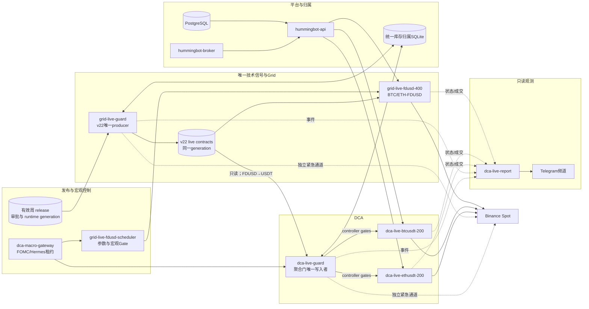
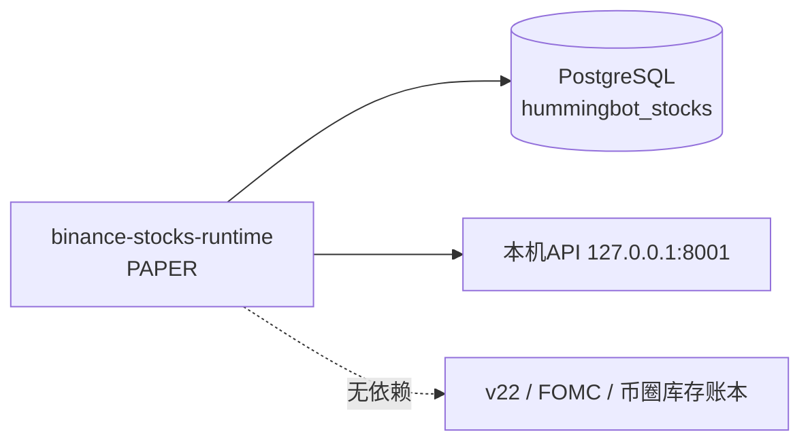

# OCI 现网容器、功能依赖与信号链路

## 1. 文档范围与事实口径

本文以 OCI 主机在 **2026-09-02** 的只读核查和当前 `master` 为基线，区分以下四种关系：

1. **启动依赖**：容器能否启动及通过健康检查。
2. **运行数据依赖**：交易或风控每个周期必须读取的合同、状态和数据库。
3. **应急控制依赖**：正常执行器失效时，Guard 用于撤单、复核和退出的独立路径。
4. **观测依赖**：报告、PNG 和 Telegram；其故障不得直接改变交易权限。

Compose 中存在但未运行的 service 不等于现网容器。以 `docker ps`、已提交的 runtime
generation、Guard 合同及 Binance 实际订单为最终事实来源。

当前加密货币生产链路的关键约束：

- `grid-live-guard` 是唯一 v22 producer；不得启动第二个 producer。
- Grid 直接消费 BTC/ETH-FDUSD 信号；DCA Guard 只读消费并映射为 BTC/ETH-USDT。
- v21、ROC、SQZMOM 和上一周模型均不是故障回退路径。
- Grid 参数自动优化当前关闭；现网固定使用 BTC `medium_sideways`、ETH
  `long_volatility` 的逐交易对参数合同。
- `binance-stocks-runtime` 当前为独立 **PAPER** 执行面，不参与 Grid/DCA 实盘信号。

动态模型身份、周覆盖和 release 见 [ONLINE_MODELS.md](ONLINE_MODELS.md)。

## 2. 当前实际运行容器

快照中有 12 个 Hummingbot/交易平台容器和 2 个宿主机外围容器。全部处于 `Up`；配置了
Docker healthcheck 的 Guard、Scheduler、Report、Macro Gateway、PostgreSQL 和股票
Runtime 均为 `healthy`。三个交易 bot 只有进程状态，`Up` 本身不能证明门控放行或正在
正常成交，仍须结合订单、合同和 controller 状态判断。

### 2.1 加密货币交易与风控

| 容器 | 网络 | 功能 | 直接依赖 | 故障影响 |
|---|---|---|---|---|
| `grid-live-fdusd-400` | host | BTC/ETH-FDUSD 现货 Grid，下单、成交、策略账本 | Binance、Grid runtime、逐对参数、宏观/技术门 | 仅 Grid 停止；DCA 与 producer 可继续运行 |
| `dca-live-btcusdt-200` | host | BTC-USDT DCA controller/executor | Binance、MQTT、DCA Guard 写入的 controller gate | BTC DCA 停止；ETH DCA 隔离 |
| `dca-live-ethusdt-200` | host | ETH-USDT DCA controller/executor | Binance、MQTT、DCA Guard 写入的 controller gate | ETH DCA 停止；BTC DCA 隔离 |
| `grid-live-guard` | bridge | 唯一 v22 producer、Grid 风控聚合、独立撤单/退出 | 当前 release、行情、API、Grid 状态、归属账本 | 合同停止刷新；超过新鲜度后 Grid/DCA Fail-Closed |
| `dca-live-guard` | bridge | v22 映射、DCA 聚合门唯一写入者、DCA 应急退出 | Grid v22 合同、宏观合同、API、DCA 状态、归属账本 | DCA 失去持续监督和应急接管，不应视为健康交易 |
| `grid-live-fdusd-scheduler` | bridge | Grid 参数合同、FOMC gate、周模型候选/预热流程 | release 目录、宏观状态、Grid 数据目录 | 已提交参数仍在；宏观合同过期或错过周更新时将限制交易 |
| `dca-macro-gateway` | bridge | Hermes/FOMC 审批租约及方向门 | HMAC secret、宏观状态卷 | 宏观状态过期后消费者 Fail-Closed；不直接写 DCA controller |
| `dca-live-report` | bridge | 唯一 Telegram 发送器、四小时 PNG、事件 outbox | 各机器人/Guard/release 只读状态、可写 outbox | 交易不受影响；通知和报告延迟，恢复后续发 |

### 2.2 平台基础设施

| 容器 | 网络 | 功能 | 直接依赖 | 是否位于逐笔订单路径 |
|---|---|---|---|---|
| `hummingbot-api-postgres` | bridge | Hummingbot API 持久化；同时承载独立股票逻辑库 | OCI 数据盘 | 否；但 API 和股票 runtime 启动依赖它 |
| `hummingbot-broker` | bridge，MQTT 仅绑定 `127.0.0.1:1883` | 机器人 MQTT 状态与控制消息 | EMQX 数据/日志卷 | 控制面依赖；机器人与 Binance 的已运行事件循环不经它转发 |
| `hummingbot-api` | bridge | 创建、停止、查询机器人并提供 Guard 控制接口 | PostgreSQL、MQTT、机器人目录、Docker socket | 不转发 Binance 订单；控制和状态读取依赖它 |

### 2.3 隔离的美股 Paper Runtime

| 容器 | 当前模式 | 功能 | 依赖和隔离边界 |
|---|---|---|---|
| `binance-stocks-runtime` | `PAPER`、live 未授权 | 美股/ETF 订单与持仓执行 API | 仅复用 PostgreSQL 物理容器，使用独立 `hummingbot_stocks` 数据库；独立目录和凭证；无 Docker socket；不消费 v22、FOMC、Grid/DCA Gate 或统一币圈库存账本 |

该容器绑定 OCI 本机 `127.0.0.1:8001`。它停止或重启只影响股票 Paper Runtime，
不应触发加密货币风控。反向同样成立：Grid/DCA Risk-Off 不得修改股票订单状态。

### 2.4 宿主机外围容器

| 容器 | 分类 | 与交易系统的关系 |
|---|---|---|
| `serverdocker-caddy-1` | 反向代理/入口 | 可代理 Hermes 宏观审批入口；不参与模型推理和订单执行 |
| `serverdocker-v2ray-1` | 宿主机网络服务 | 不属于 Hummingbot 交易或风控依赖 |

这两个容器不属于本发布族 Compose，不得因为它们在 `docker ps` 中出现而计入交易
producer 或交易机器人数量。

### 2.5 已定义但当前不常驻

- `grid-live-fdusd-manager`、`dca-live-manager`：一次性部署/管理工具。
- `hummingbot-mcp`、`hummingbot-condor`：按需 profile，不在当前生产信号链。
- paper scheduler、历史 observer/shadow producer：当前未运行，不得自动启用。

## 3. 总体拓扑



Grid内部还存在一条逐对订单形成链：

```text
active_selection参数 + mid/best bid/ask + Grid账本 + 交易所过滤器
                              │
                              ▼
                 理论层 → 预算/库存裁剪 → 成本底线
                              │
                              ▼
                  同价SELL层合并 → Maker安全检查
                              │
                              ▼
                     Binance实际活动订单
```

因此参数合同中的理论9/9层不是活动订单数量；最终订单数必须回到Binance核验。

美股 Paper Runtime 是旁路：



## 4. 核心信号链路

### 4.1 v22 技术门

1. 发布流程生成内容寻址 release、审批回执和 runtime generation。
2. `grid-live-guard` 校验当前周覆盖、模型/特征/策略/数据哈希、授权和行情新鲜度。
3. producer 在同一 generation 下原子刷新两种投影：Grid 执行面读取
   `xgboost_risk_gate.json`，DCA Guard 读取只读挂载的
   `ethbtc_forced_exit_observation.json`；两者逐对语义均为 `RISK_ON`、`RISK_OFF`
   或 `UNAVAILABLE`。
4. Grid 直接按 BTC/ETH-FDUSD 消费执行合同；DCA Guard 固定映射：
   - `BTC-USDT ← BTC-FDUSD`
   - `ETH-USDT ← ETH-FDUSD`
5. `UNAVAILABLE` 是完整性失败，不是正常模型 Risk-Off；不得回退旧模型。

### 4.2 宏观门

1. `dca-macro-gateway` 持久化 Hermes/FOMC 租约和受限方向。
2. Scheduler 消费宏观状态并发布 Grid `macro_gate.json`。
3. DCA Guard 直接消费宏观状态并与其他门做逻辑 AND。
4. Macro Gateway 的 execution 开关关闭时，它仍只生成意图/租约，不直接修改 DCA
   controller；最终写入者仍是 DCA Guard。

### 4.3 Grid 参数

1. Scheduler 原子写入 `active_selection.json` schema v2。
2. 每对参数独立：BTC 为 `medium_sideways`，ETH 为 `long_volatility`。
3. Grid 每周期只读取一个完整合同，参数切换不得重置累计盈亏、权益峰值、库存归属或
   风控恢复阶段。
4. 当前自动参数优化开关关闭；Scheduler 只维护已批准固定合同，不会自主训练并替换
   Grid 参数。

### 4.4 Grid订单构建

1. Grid策略从`active_selection.json`读取BTC/ETH逐对参数，并从Runtime State恢复Grid中心、
   策略账本和恢复阶段。
2. BUY受现金、每侧预算、组合剩余资金及10 FDUSD额外库存额度共同限制；SELL受策略基础币、
   启动库存上限和交易所可用余额共同限制。
3. SELL价格不得低于普通止盈线和移动平均成本利润底线。多个逻辑层落到同一量化价格时，
   合并为一张订单。
4. 动态精度、最低金额和Maker盘口检查通过后才发送普通订单；穿价层只进入单层延迟队列。
5. Runtime State记录预计/实际层数，Guard叠加门控后输出`effective_order_status`；Report只读展示。

完整规则见 [GRID_PAIR_PARAMETER_CUTOVER.md](GRID_PAIR_PARAMETER_CUTOVER.md)。

### 4.5 DCA 聚合门

`dca-live-guard` 是 DCA controller gate 的唯一写入者。最终普通交易权限为：

```text
v22技术门
AND FOMC门
AND 策略亏损/回撤门
AND 组合亏损/回撤门
AND 持仓保护
AND 基础设施完整性
AND recovery phase=ACTIVE
```

资金预算门当前是告警/容量信息，不单独阻塞交易。强制退出、止损和紧急动作不受普通
BUY 门阻止；在 `EXITING/COOLDOWN/REENTRY` 期间为避免竞态，聚合门可暂时关闭双侧。

### 4.6 统一库存归属

两个 Guard 共享账户级 SQLite 账本，按以下证据核对余额：

```text
Grid归属 = capital_reservations + Grid净成交 + 紧急调整
DCA归属  = managed_inventory + DCA净成交 + 紧急调整
无归属   = Binance实际余额 - Grid归属 - DCA归属
```

- Guard 退出前必须取得资产租约，只出售自身归属。
- 归属合计超过实际余额时进入 `ownership_deficit` Fail-Closed，不能卖其他策略库存补差。
- `dca-live-report` 只读该账本；Dust 只在报告中按报价币金额展示，不改变交易权限。

## 5. 合同、存储与写入所有权

| 合同/存储 | 唯一或主要写入者 | 消费者 | 用途 |
|---|---|---|---|
| `runtime/current.json` 与 generation 目录 | release/cutover 流程 | Grid Guard、审计 | 原子绑定 release、授权、状态和哈希 |
| `xgboost_risk_gate.json` | `grid-live-guard` | Grid、report | Grid v22 执行合同 |
| `ethbtc_forced_exit_observation.json` | `grid-live-guard` | DCA Guard、report | DCA只读投影、逐资产状态和事件 |
| `active_selection.json` | scheduler | Grid、report | Grid 逐对参数与参数哈希 |
| `dca-macro-data/state.json` | macro gateway | scheduler、DCA Guard | FOMC/Hermes 租约和方向门 |
| `macro_gate.json` | scheduler | Grid、report | Grid 宏观执行门 |
| DCA controller gate | `dca-live-guard` 经 API | 两个 DCA bot、report | BUY/SELL 最终权限 |
| `account_inventory.sqlite` | 两个 Guard，资产租约串行化 | 两个 Guard、report只读 | 账户级归属、任务、成交与Dust周期 |
| `account_inventory_status.json` | 归属协调逻辑 | Guards、report、运维 | 余额、归属、缺口、健康、活动订单 |
| 各 Guard `guard_state.json` | 对应 Guard | 对应 Guard、report | 阶段、冷却、锁存、重启恢复 |
| 机器人实例 SQLite/TradeFill | 对应机器人/Hummingbot | Guards、report | 订单、成交、权益及净成交证据 |
| Telegram event/outbox | Guards/scheduler产事件；report写outbox | `dca-live-report` | 幂等通知、重试、Telegram message ID |
| PostgreSQL `hummingbot_api` | `hummingbot-api` | API | 机器人编排持久化 |
| PostgreSQL `hummingbot_stocks` | stocks runtime | stocks runtime | 与币圈交易隔离的股票 Paper 状态 |

关键挂载权限：

- v22 release 和模型包对 Guard 为只读。
- Grid v22 合同目录对 DCA Guard 为只读。
- 统一库存 SQLite 对两个 Guard 可写，对 report 只读。
- Bot 实例状态对 report 只读；report 只能写自己的缓存和 outbox。
- Docker socket 仅交给需要编排或应急控制的 API/Guard；股票 runtime 和 report 不应持有。

## 6. 故障域与真实影响

| 故障 | 短时行为 | 持续后的行为 |
|---|---|---|
| PostgreSQL 不可用 | 已运行币圈 bot 可能暂时继续其事件循环 | API 编排失效；股票 runtime 不可用；Guard 控制读取失败后按阈值保护 |
| MQTT broker 不可用 | 已运行 bot 仍可能直接连接 Binance | 状态/控制消息缺失，API/Guard 无法可靠编排，不能标记“正常交易” |
| Hummingbot API 短暂断连 | Guard 的 GET 连接适配器丢弃旧连接池并重试 | Grid Guard 默认持续60秒才 Fail-Closed；紧急 Binance/Docker 路径仍保留 |
| `grid-live-guard` 停止或合同不刷新 | 消费者可在新鲜度窗口内使用最后完整合同 | 合同过期后 Grid/DCA Fail-Closed；禁止 v21/旧周回退 |
| scheduler 停止 | 已提交参数合同继续存在 | 宏观 gate 过期会限制 Grid；长期还会错过下周候选/预热 |
| macro gateway 停止 | 最后租约在有效期内继续生效 | 状态过期后 scheduler/DCA Guard Fail-Closed |
| `dca-live-guard` 停止 | 最后写入的 controller gate 可能暂存 | DCA 无持续监督和应急接管，应判为非正常交易并人工处置 |
| report/Telegram 停止 | 不改变 Gate 或订单 | 报告和告警排队，outbox 恢复后重试 |
| 单个交易 bot 停止 | 对应交易对不再执行 | 另一个 bot 保持隔离；Guard/report 应明确显示该对停止 |
| 归属账本不可信 | 禁止新增跨归属操作 | Fail-Closed，任何 Guard 均不得出售其他机器人余额 |
| stocks runtime 停止 | 仅股票 Paper API 不可用 | Grid/DCA 不受影响 |

短暂连接失败不得直接锁存或清仓。只有达到既有连续失败/持续时间门槛，或当前已提交
generation 本身确实失效时，才进入完整性 Fail-Closed。

## 7. 启动与恢复顺序

冷启动建议顺序：

1. `hummingbot-api-postgres`、`hummingbot-broker`。
2. `hummingbot-api`，确认数据库、MQTT 和机器人目录可用。
3. `dca-macro-gateway`。
4. `grid-live-fdusd-scheduler`。
5. `grid-live-guard`，确认当前 generation、周覆盖和合同持续刷新。
6. `dca-live-guard`，确认与 Grid 所见 generation/event ID 一致。
7. 核对宏观门、七类风险门、统一库存归属和动态过滤器。
8. 仅在确需冷启动时启动三个交易 bot；滚动维护不要无故重启交易 bot。
9. `dca-live-report` 最后启动，确认 outbox 和四小时报告恢复。

`binance-stocks-runtime` 只需 PostgreSQL 健康即可独立启动；它不应被插入上述币圈
Gate 恢复顺序。

## 8. 现网核验命令

以下命令只读，不输出 secret：

```powershell
docker ps --format "table {{.Names}}\t{{.Image}}\t{{.Status}}\t{{.Networks}}"

docker inspect --format "{{.Name}} {{if .State.Health}}{{.State.Health.Status}}{{else}}{{.State.Status}}{{end}}" `
  grid-live-guard dca-live-guard dca-live-report grid-live-fdusd-scheduler

docker logs --since 10m grid-live-guard
docker logs --since 10m dca-live-guard
docker logs --since 10m grid-live-fdusd-400
```

验收时还必须核对：

1. Binance 实际活动订单、余额和成交。
2. 三个交易 bot 的进程、Grid runtime、DCA controller/executor。
3. 两个 Guard 的阶段、合同年龄、generation、event ID 和紧急通道。
4. `account_inventory_status.json` 的 `sources_healthy`、`ownership_deficit`、归属和 Dust。
5. Telegram/PNG 只用于解释；不能用“消息已发送”代替交易事实核验。

## 9. 不变量

- 生产中只有一个 v22 producer。
- DCA Guard 是 DCA controller gate 唯一写入者。
- report、Telegram、Caddy、Xray 和 stocks runtime 均不能授予币圈交易权限。
- 参数、模型、FOMC 或任一风险门恢复，不能覆盖仍生效的其他门。
- 强制退出只出售机器人资金边界内的归属库存，不按账户总余额清仓。
- 完整性故障不回退 v21、ROC、SQZMOM、旧 release 或上一周模型。
- 候选预热失败不能污染当前健康合同；只有已提交 generation 失效才影响交易。
